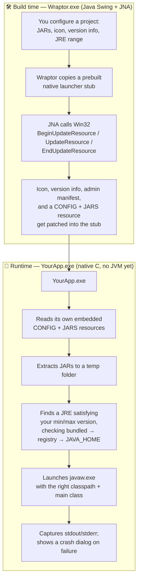

<div align="center">

# 🦖 Wraptor

**Wrap Java JARs into native, icon-branded Windows `.exe` launchers.**
No bundled JRE required. No third-party runtime. Just a small native stub and your JAR.

</div>

---

## What is this?

Wraptor is a desktop GUI (Java Swing) that takes your Java application — a main JAR plus its dependency JARs — and produces a real, double-clickable Windows `.exe`. That `.exe` isn't a zip-with-an-icon trick: it's a genuine PE executable with your icon, your company/version info, and (optionally) a UAC admin-privilege manifest baked directly into its Windows resources, wrapped around a tiny native launcher that finds a suitable JRE and starts your app.

No embedded browser, no Electron, no bundled 200MB runtime unless you explicitly want one — just your JARs and a ~250KB native stub.

## ✨ Features

- 🎨 **Real icon embedding** — your `.ico` is patched directly into the `.exe`'s `RT_GROUP_ICON`/`RT_ICON` resources, not just a shortcut icon.
- 📋 **Version info that shows up in Explorer** — Company, File Description, Copyright, File/Product Version all appear under *Properties → Details*, like a "real" Windows app.
- ☕ **JRE version enforcement, actually enforced** — set a minimum/maximum Java version and the native launcher checks every candidate JRE it finds (bundled, registry, `JAVA_HOME`) and picks the best match, or fails with a clear message instead of silently launching the wrong one.
- 🔐 **UAC admin manifest** — optionally require elevation on launch.
- 🪟 **32-bit and 64-bit builds** from one project, in one click.
- 🔒 **Single-instance mode** — prevent a second copy of your app from starting.
- 🧵 **Crash-visible launcher** — if your app throws on startup, the native stub captures its stdout/stderr and shows it in a message box instead of silently vanishing.
- 🧭 **Real-time validation** — the build refuses to run with a missing main jar, invalid app name, unwritable output folder, or malformed main class, and tells you exactly which one.

## 🧠 How it works

Wraptor is really two separate programs working together:



The native launcher (`stub.c`) is a small, dependency-light Win32 program compiled once per architecture with MinGW-w64. Its compiled bytes are embedded directly into Wraptor's own `.class` file as base64 (`EmbeddedStubs.java`) — no loose resource files that can go missing from a build, and no per-project recompilation needed. Every `.exe` Wraptor produces is a copy of that same stub with your project's resources patched in.

## 🚀 Getting started

### Prerequisites

| For | You need |
|---|---|
| Building/running the Wraptor GUI | JDK 8+, [NetBeans](https://netbeans.apache.org/) (or Ant directly) |
| Rebuilding the native stub | Windows + [MSYS2](https://www.msys2.org/) with **both** the `mingw-w64-i686-toolchain` and `mingw-w64-x86_64-toolchain` packages installed |
| Using Wraptor to build an app | Just a JRE — MSYS2 is only needed if you're modifying the native stub itself |

### 1. Build the Java GUI

The JNA jar is already vendored under `Wraptor/src/lib/`, so no dependency download is needed.

```bash
# Open Wraptor/ in NetBeans and hit Build, or from the command line:
cd Wraptor
ant jar
```

This produces `dist/Wraptor.jar` — run it with `java -jar Wraptor.jar`.

### 2. (Optional) Rebuild the native launcher stub

You only need this if you're changing `stub.c` itself — the prebuilt stub bytes already shipped in `EmbeddedStubs.java` are enough to build apps out of the box.

From `Wraptor/native-stub/`, with MSYS2 installed:

```
build-all.bat
```

This runs, in order:

1. **`compile-stub.bat`** — cross-compiles `stub.c` into `stub32.exe` and `stub64.exe` with MinGW-w64.
2. **`copy-to-project.bat`** — copies the fresh stubs into `src/native/`.
3. **`generate-embedded-stubs.bat`** — base64-encodes both stubs and regenerates `src/wraptor/resource/EmbeddedStubs.java`.

Then do a Clean and Build on the Wraptor project in NetBeans to pick up the change.

### 3. Use Wraptor to build your app

1. **JARs tab** — add your main jar and any dependency jars. If exactly one of them declares a `Main-Class` in its manifest, it's auto-flagged as the main jar; otherwise right-click one → *Set as Main Jar*.
2. **Application tab** — app name, output folder, icon, target OS versions, architecture(s), admin/single-instance flags.
3. **Java tab** — main class (auto-filled from the main jar's manifest), JVM arguments, JRE min/max version.
4. **EXE Info tab** — file/product version, company name, description, copyright — shown in Explorer's Properties dialog.
5. Hit **Build EXE**.

Your `.exe`(s) land in the output folder you chose, ready to double-click.

## 🩹 Troubleshooting

- **`libgcc_s_dw2-1.dll was not found` while recompiling the stub** — MinGW's compiler frontend spawns helper processes (`cc1.exe`, `as.exe`) that need `mingw32\bin`/`mingw64\bin` on `PATH` to find their own runtime DLLs. `compile-stub.bat` sets this for you; if you're invoking the compiler manually, make sure that directory is on `PATH`.
- **Antivirus flags the generated `.exe` or slows down a build** — unsigned launcher stubs that self-extract JARs at runtime are a common false-positive pattern for heuristic AV engines. Adding an exclusion for your output folder avoids build-time file-lock races too.
- **App launches, then immediately closes with no error** — check the exit code (`echo %ERRORLEVEL%` right after running it from a command prompt). A code of `0` means your app exited normally (e.g. an uncaught exception was already handled and it returned early); non-zero means the launcher's crash dialog should have shown the captured output.

## 📄 License

MIT — see [`LICENSE`](LICENSE).
